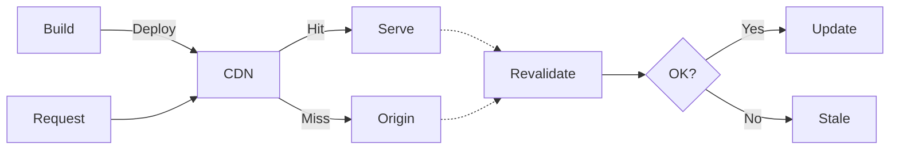
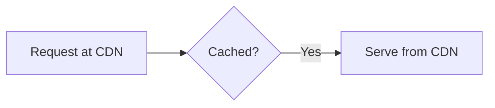
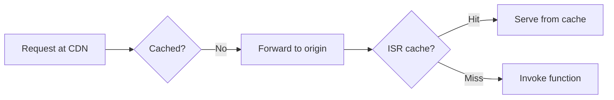
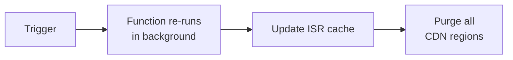
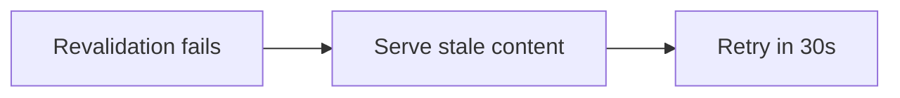

# Incremental Static Regeneration (ISR)

> **Availability**: Incremental Static Regeneration is available on all plans

Incremental Static Regeneration (ISR) is a caching strategy that combines the speed of static content with the flexibility of server-side rendering. It follows the stale-while-revalidate pattern: visitors get a fast cached response, and Vercel regenerates the page in the background based on a time interval or an API call you trigger.

<!-- docsgraph:related -->
## Related pages

> **For AI agents:** Follow these links to understand how this page connects to the rest of the Vercel ecosystem. For the full cross-link map (inbound, outbound, prerequisites, and semantic neighbors), see the .graph.md link below.

- [ISR: A flexible way to cache dynamic content](https://vercel.com/blog/isr-a-flexible-way-to-cache-dynamic-content?from=related&source_path=%2Fdocs%2Fincremental-static-regeneration&source_site=vercel-docs&relationship=related)
- [How to reduce ISR revalidation costs](https://vercel.com/kb/guide/how-to-reduce-isr-revalidation-costs?from=related&source_path=%2Fdocs%2Fincremental-static-regeneration&source_site=vercel-docs&relationship=related) — Reduce ISR costs by analyzing Incremental Static Regeneration \\(ISR\\) behavior to find pages and tags that revalidate to
- [Deploys are now up to 33% faster for apps with many ISR pages](https://vercel.com/changelog/deploys-are-now-up-to-33-faster-for-apps-with-many-isr-pages?from=related&source_path=%2Fdocs%2Fincremental-static-regeneration&source_site=vercel-docs&relationship=related)
- [Flags SDK 3.2](https://vercel.com/changelog/flags-sdk-3-2?from=related&source_path=%2Fdocs%2Fincremental-static-regeneration&source_site=vercel-docs&relationship=related)
- [Fluid compute now supports ISR background and on-demand revalidation](https://vercel.com/changelog/fluid-compute-now-supports-isr-background-and-on-demand-revalidation?from=related&source_path=%2Fdocs%2Fincremental-static-regeneration&source_site=vercel-docs&relationship=related)
- [Incremental Static Regeneration (ISR) is now faster and more cost-efficient](https://vercel.com/changelog/incremental-static-regeneration-is-now-faster-and-cheaper?from=related&source_path=%2Fdocs%2Fincremental-static-regeneration&source_site=vercel-docs&relationship=related)
- [Request collapsing for ISR cache misses](https://vercel.com/changelog/request-collapsing-for-isr-cache-misses?from=related&source_path=%2Fdocs%2Fincremental-static-regeneration&source_site=vercel-docs&relationship=related)
- [Making your catalog discoverable to AI agents](https://vercel.com/kb/guide/agentic-commerce-readiness?from=related&source_path=%2Fdocs%2Fincremental-static-regeneration&source_site=vercel-docs&relationship=related) — Agentic commerce readiness starts with the initial HTML response. Server-render your product catalog, ship JSON-LD, and
- [Astro on Vercel vs Webflow Cloud](https://vercel.com/kb/guide/astro-on-vercel-vs-webflow-cloud?from=related&source_path=%2Fdocs%2Fincremental-static-regeneration&source_site=vercel-docs&relationship=related) — Compare running Astro on Vercel Functions with Fluid compute against Webflow Cloud on Cloudflare Workers. Learn how Astr
- [Build with a Nitro starter template](https://vercel.com/kb/guide/build-with-a-nitro-starter-template?from=related&source_path=%2Fdocs%2Fincremental-static-regeneration&source_site=vercel-docs&relationship=related) — Deploy a Nitro app to Vercel from a starter template. Compare the Nitro Starter, route rules, cached HTTP handler, plugi
- [Caching audits: Five antipatterns that cost performance and money](https://vercel.com/kb/guide/caching-antipatterns?from=related&source_path=%2Fdocs%2Fincremental-static-regeneration&source_site=vercel-docs&relationship=related) — Five caching antipatterns from hundreds of Vercel technical audits: write amplification, deploy-wiped caches, spinner sh
- [Preventing the stampede: Request collapsing in the Vercel CDN ](https://vercel.com/blog/cdn-request-collapsing?from=related&source_path=%2Fdocs%2Fincremental-static-regeneration&source_site=vercel-docs&relationship=related)

Full cross-link map for this page: [/docs/incremental-static-regeneration.graph.md](/docs/incremental-static-regeneration.graph.md?from=related&source_path=%2Fdocs%2Fincremental-static-regeneration&source_site=vercel-docs&relationship=graph)
<!-- /docsgraph:related -->

Vercel's CDN provides fully managed caching and routing when you implement ISR with frameworks like Next.js, SvelteKit, Nuxt, and Astro.

Use ISR when your content updates on a known schedule (minutes to hours) rather than in real time:

- **E-commerce**: Large product catalogs that need current pricing and availability without rebuilding the entire site.
- **Media and publishing**: Content pages that update when authors publish in a headless CMS.
- **Generative AI platforms**: Pages generated from discrete events like git syncs or API updates, not continuous streams.

To get started:

- [Set up ISR](#using-isr) with your framework
- Learn [how ISR works](#how-isr-works) from build time through revalidation
- See [how ISR compares](#caching-on-vercel) to other caching strategies

## Benefits of Vercel's CDN for ISR

When you deploy ISR with your framework on Vercel, the CDN adds these optimizations:

- **Zero configuration overhead**: Vercel's CDN applies the right caching strategy based on your framework code. It manages `Cache-Control` headers automatically.
- **Durable storage**: The ISR cache lives alongside your [Function region](/docs/functions/configuring-functions/region) and persists content for the duration you specify, until you revalidate it or it goes unaccessed for 31 days. It is scoped to a specific deployment where each deployment generates its own cache.
- **Cache shielding**: On a CDN miss, Vercel reads from the ISR cache before invoking your function, reducing load on your origin.
- **Automatic request collapsing**: When multiple requests hit the same uncached path, Vercel [collapses them](/docs/incremental-static-regeneration/request-collapsing) into one function invocation per region, protecting your backend during traffic spikes.
- **Globally consistent purging**: When you revalidate content, all caches across all regions update within 300ms. Vercel purges HTML and data payloads together, so users see consistent content across full page loads and client-side transitions.
- **Selective pre-rendering**: You can pre-render popular pages at build time and generate the rest on demand as visitors request them. This speeds up your builds.
- **Instant rollbacks**: Cached content from previous deployments are not purged, so you can roll back without losing previously generated content. However, each new deployment uses its own ISR cache and does not reuse the cache from a previous deployment.

## Using ISR

ISR works with your framework's existing APIs. Your framework code defines how each route behaves, and Vercel handles the caching automatically.

| Framework                  | How to enable ISR                         | Details                                                                                  |
| -------------------------- | ----------------------------------------- | ---------------------------------------------------------------------------------------- |
| **Next.js** (App Router)   | Export `revalidate` from a route segment  | [Getting started](/docs/incremental-static-regeneration/quickstart)                      |
| **Next.js** (Pages Router) | Return `revalidate` from `getStaticProps` | [Getting started](/docs/incremental-static-regeneration/quickstart)                      |
| **SvelteKit**              | Export `config` with `isr` property       | [SvelteKit on Vercel](/docs/frameworks/full-stack/sveltekit#incremental-static-regeneration-isr)    |
| **Nuxt**                   | Add `routeRules` with `isr` option        | [Nuxt on Vercel](/docs/frameworks/full-stack/nuxt#incremental-static-regeneration-isr)              |
| **Astro**                  | Configure server output with ISR          | [Astro on Vercel](/docs/frameworks/frontend/astro#incremental-static-regeneration)                |
| **Gatsby**                 | Use DSG (Deferred Static Generation)      | [Gatsby on Vercel](/docs/frameworks/frontend/gatsby#incremental-static-regeneration)              |
| **Build Output API**       | Define Prerender Functions                | [Prerender Functions](/docs/build-output-api/primitives#prerender-configuration-file) |

To cache data inside your functions separately from the page response, see [Runtime Cache](/docs/caching/runtime-cache).

## How ISR works

ISR follows a lifecycle from build through serving and revalidation. The diagram below shows the complete flow. Each section that follows focuses on one stage.

### At build time

Your framework code defines which routes are static, cacheable, or dynamic. When you deploy, Vercel analyzes this and distributes route metadata to every CDN region. Before any request arrives, each region already knows which paths are cacheable. Because Vercel knows cacheability ahead of time, it can selectively pre-render content and collapse concurrent requests to the same path.

### At request time (cache hit)

A request arrives at the nearest CDN region. Vercel checks local caches in that region. If the content is cached and its tags are still valid, Vercel serves the response immediately from the CDN. Your function doesn't run.

### At request time (cache miss)

If the CDN doesn't have a valid cached response, Vercel forwards the request to your Function region. If multiple requests hit the same uncached path at once, Vercel collapses them into a single invocation. Vercel then checks the durable ISR cache. If the cache has the content, Vercel serves it from the origin and replicates it back to the CDN. If not, Vercel invokes your function, which can read from the data cache and your backend. Vercel stores the response in the ISR cache and serves it to the user.

### At revalidation time

Two triggers can update cached content:

- **Time-based revalidation** runs automatically after a set interval
- **On-demand revalidation** runs when you call an API

Both execute in the background: visitors continue to get the cached version while Vercel generates the new content. Once the new version is ready, Vercel updates all representations of the path together. It purges HTML and data payloads atomically and propagates new content to all CDN regions through a global push pipeline.

### On failure

If revalidation fails, Vercel keeps serving the existing cached content. Vercel considers a revalidation failed when it encounters:

- **Network errors**: Timeouts, connection failures, or other transport-layer issues
- **Invalid HTTP status codes**: Any status code other than 200, 301, 302, 307, 308, 404, or 410
- **Server errors**: Function execution failures or runtime errors

When a failure occurs, Vercel preserves the stale content and sets a 30-second Time-To-Live (TTL), so it retries revalidation shortly after.

## Caching on Vercel

Vercel provides several caching strategies depending on your architecture. ISR is one of four approaches:

### Frameworks with ISR support

Next.js, SvelteKit, Nuxt, Astro, and Gatsby declare which routes are cacheable at build time. Vercel handles CDN caching, durable ISR storage, request collapsing, and revalidation automatically.

Use ISR when:

- Your framework supports it
- You need cached pages to survive deployments and rollbacks
- You need all regions to serve the same content version
- You want request collapsing to protect your backend during traffic spikes

Your ISR cache uses your project's [default Function region](/docs/functions/configuring-functions/region#setting-your-default-region). You can change this region in your project's **Settings**. See [ISR cache region](/docs/incremental-static-regeneration/limits-and-pricing#isr-cache-region) for details on how the region affects pricing and performance.

With ISR, Vercel knows a path is cacheable before the first request arrives. That's what enables request collapsing, durable storage, 300ms global purges, instant rollbacks, and path grouping. With `Cache-Control` headers alone, Vercel doesn't know a path is cacheable until it receives the response, so these features aren't available.

### APIs with Cache-Control headers

API routes and custom backends cache responses in the CDN by setting `Cache-Control` headers. Vercel caches the response per region after the first request. Use this when your framework doesn't support ISR or you need per-region response caching with manual control. See [CDN cache](/docs/caching/cdn-cache).

### Image optimization

Vercel transforms and [optimizes images](/docs/image-optimization), caching them on the CDN for fast delivery. This is a separate caching layer from ISR and `Cache-Control`.

### External origins

Vercel can cache requests proxied to external origins via [rewrites](/docs/routing/rewrites), reducing load on your origin. See [CDN cache](/docs/caching/cdn-cache).

### Data caching inside functions

In addition to response caching, [Runtime Cache](/docs/caching/runtime-cache) caches data inside your functions: individual fetch results, database queries, or computed values. It works alongside any of the approaches above.

## Pricing and limits

When you use ISR with a framework on Vercel, Vercel creates a function based on your framework code. You incur usage for:

- **Function invocations**: ISR functions run whenever they revalidate in the background or through [on-demand revalidation](/docs/incremental-static-regeneration/quickstart#on-demand-revalidation)
- **ISR writes**: Vercel persists fresh content to durable storage for the duration you specify, until it goes unaccessed for 31 days
- **ISR reads**: Vercel reads from the ISR cache when the CDN doesn't have the content
- **[Fast Origin Transfer](/docs/manage-cdn-usage#fast-origin-transfer)**: Data transferred from the Function region

For detailed pricing, usage metrics, and optimization strategies, see [ISR usage and pricing](/docs/incremental-static-regeneration/limits-and-pricing).

### On-demand revalidation limits

On-demand revalidation applies to the domain and deployment where you trigger it, and doesn't affect subdomains or other deployments.

For example, if you trigger on-demand revalidation for `example-domain.com/example-page`, Vercel won't revalidate `sub.example-domain.com/example-page`. Subdomains and other deployments aren't affected.

## More resources

- [Getting started with ISR](/docs/incremental-static-regeneration/quickstart)
- [ISR usage and pricing](/docs/incremental-static-regeneration/limits-and-pricing)
- [Monitor ISR on Vercel](/docs/query/monitoring)
- [Runtime Cache](/docs/caching/runtime-cache)
- [CDN cache](/docs/caching/cdn-cache)

---

[View full sitemap](/docs/sitemap)
